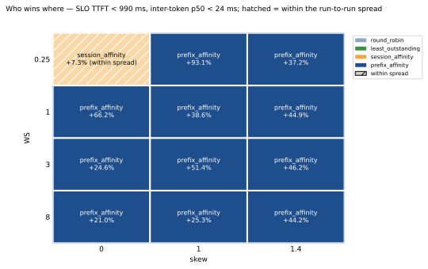

# kvroute

**Where does cache-aware routing stop paying for itself against plain consistent-hash session
affinity?**

kvroute is a KV-cache-aware router in front of six single-GPU vLLM replicas, built to answer that
question and nothing else. The deliverable is a measured comparison of routing policies, not a
service. Full report: [`docs/REPORT.md`](docs/REPORT.md); vocabulary: [`CONTEXT.md`](CONTEXT.md); spec: [`idea.md`](idea.md).

This page is the two-minute version: five findings, one figure each, then the commands.

## At a glance

| | |
|---|---|
| fleet | six replicas of `Meta-Llama-3.1-8B-Instruct-AWQ-INT4`, one RTX 3090 each; five used for the comparison — GPU 3 thermally throttles and is excluded ([#25](https://github.com/yuchia329/kvroute/issues/25)) |
| policies | 6 implemented — round robin, least outstanding, session affinity, prefix affinity, exact residency, prefix hash; 5 measured on the fleet |
| SLO | TTFT < 990 ms, inter-token p50 < 24 ms — **3× the measured latency floor** (329 ms / 7.8 ms), derived rather than chosen |
| records | 746 cell records across 17 measurement campaigns; the largest, ~122,500 requests |
| repetitions | 3 per cell, spread published, ranges beside every median |
| reproduce | `make figures` — no fleet, no GPU |

## Five findings

### Cache-aware routing pays everywhere except the low-pressure corner


At the frozen comparison point (working set 1, skew 0) prefix affinity beats session affinity by
**+66.2%**, non-overlapping repetition ranges. At the opposite corner — working set 0.25, skew 0,
whole working set in cache, no imbalance to fix — it is **−6.8%, within spread**: indistinguishable,
exactly where idea.md §0 predicted.

| WS \ skew | 0 | 1 | 1.4 |
|---|---:|---:|---:|
| **0.25** | −6.8% (within spread) | +289.8%¹ | +373.0% |
| **1** | +66.2% | +38.6% | +171.2% |
| **3** | +24.6% | +51.4%² | +346.9% |
| **8** | +21.0% | +25.3% | +162.4% |

¹ Two repetitions: one flagged for warm-up drift, re-run, drifted harder; direction holds either
way. ² Also two repetitions, after the rebuilt drift check set one aside as a cold opening
([#33](https://github.com/yuchia329/kvroute/issues/33)); published as +41.3%.
[Measurement](docs/measurements/2026-09-11-pressure-grid/).

### The mechanism is load, not cache reuse

Between the two affinity policies the prefix cache hit rate differs by only 0.0–2.2 points at
every point of the grid. What separates them is where load lands.

| | |
|---|---|
| hit rate gap, session vs prefix affinity | 0.0–2.2 points |
| spill-off arm (prefix affinity, rule disabled) | loses 5–51% of goodput at 11 of 12 points |
| busiest replica's share of requests, rule on | 21–22% (fair share) |
| share of decisions the spill rule fires on | 0.2–2.5% |

Session affinity hashes a conversation onto one replica and keeps it there, so concentrated traffic
piles onto one card. Prefix affinity's spill rule moves a turn of an overloaded conversation
elsewhere, which then caches it too — the match ties, and the tie goes to the least loaded: a rule
firing on a fortieth of decisions accounts for up to a doubling of goodput.
[Measurement](docs/measurements/2026-09-11-pressure-grid/).

### Who wins where: the four-policy map



From `go run ./cmd/regimemap` over the pressure grid's cells: prefix affinity has the highest
goodput at 11 of 12 points beyond the spread, tying at working set 0.25 / skew 0, where session
affinity is ahead by +7.3%, within spread.

The runner-up flips with skew: session affinity at skew 0 and 1, least outstanding at skew 1.4,
where session affinity falls to about round robin's level — WS 1: 11.23 against 11.22; WS 3: 6.44
against 11.23, below it; WS 8: 10.69 against 10.21. Stickiness alone is worth roughly twice round
robin under even traffic and nothing under skewed traffic; prefix affinity is the only policy best
or tied everywhere, because it is both affinity and load balancing.
[Measurement](docs/measurements/2026-09-11-pressure-grid/regimemap.md).

### Knowing what is cached loses to remembering what was sent

The ladder is **none < exact < believed**: a router that knows nothing (a stateless hash of the
prompt's leading blocks) trails one that believes what its replicas hold (the prefix index), which
beats one that actually asks (exact residency).

| | |
|---|---|
| index over stateless hash | +5.4% to +25.2% goodput, median +11.0%, at 11 of 12 points |
| exact residency vs the index | 4.6–13.5% *below* it at 11 of 12 points |
| tokenize round-trip (exact residency) | 26.0 ms p50, against the index's 0.38 ms of total router overhead |
| prefix cache hit rate | 0.8973 (exact) vs 0.9088 (index) |
| new tokens computed per request | +12.7% under exact residency |

The index records what the router *sent* and herds concurrent requests sharing a new prefix onto
one replica; exact residency knows only what has been *reported*, so they scatter while the first
prefills — twice the deficit on first turns as on later ones. Near-exact predictions: a placement
failure, not an accuracy one.

This is narrower than "beliefs beat facts", and llm-d measured the opposite: its event-fed precise
index beat its approximate one, P90 TTFT 0.542 s against 31.083 s (2025-09-24). Two things differ.
kvroute's exact residency pays a 26 ms `/tokenize` round trip, and it has nothing like llm-d's
optional speculative indexing, which also records what the router just sent for 2 s — the belief,
layered on the facts. So the result says an event-fed index *without* that layer loses; an exact
index with it is not measured here.

[Stateless hash](docs/measurements/2026-09-12-stateless-hash/), [exact residency](docs/measurements/2026-09-12-exact-residency/).

### How wrong the index is

The router models cache state it does not own. Over 19,391 requests of the clean working-set run,
**99.7% of the tokens the index claimed were really there**. The errors run the safe way: 17,845
requests under-predicted against 1,531 that over-predicted — never netted into one figure.

| working set | requests | honoured | over-predicted | mean tokens over |
|---|---:|---:|---:|---:|
| 0.25 | 10,626 | 100.0% | 951 | 4 |
| 1 | 3,689 | 98.9% | 317 | 314 |
| 3 | 2,639 | 99.2% | 169 | 246 |
| 8 | 2,437 | 99.5% | 94 | 241 |

Memory pressure makes the index wrong in **bigger pieces, not more often**: the over-predicting
count falls monotonically while the mean over-prediction jumps eighty-fold between WS 0.25 and
WS 1. The belief also decays with age: 99.8% honoured at 1–2 s, falling to **86.0% at 30 s – 1 m**
— the bucket beneath the measured 57 s TTL — and back to 98.1% past it.

[Belief divergence](docs/measurements/2026-09-10-belief-divergence/), [recency re-run](docs/measurements/2026-09-12-recency-rerun/).

## Results that overturned themselves

- **An earlier six-card headline is withdrawn.** It concluded balancing load *cost* goodput; GPU 3
  thermally throttles when all six cards draw power at once, feeding round robin a sacrificial queue. On five symmetric cards the same pair inverts.
- **Exact residency loses to the belief it was meant to replace**, 11 of 12 points, 4.6–13.5% of goodput — see the fourth finding above.
- **The warm-up drift check was wrong in three ways**; rebuilding it moved 118 of 216 recorded open-loop cells' verdicts ([#33](https://github.com/yuchia329/kvroute/issues/33)).
- **The spill rule is tuned for one load and misfires at another**: 19% of later turns at 6 req/s open-loop spilled, against 0.674% at the 32-user rung it was settled at ([#31](https://github.com/yuchia329/kvroute/issues/31)).
- **The spill rule's residency branch is harmful at every threshold measured** — 35 of 35 points,
  5% to 91% — so it ships off (`HitRateLowWater: 0`).

## What breaks, and what it costs


One replica killed under steady open-loop load, restarted 60 s later. Both policies lost exactly
**one request of 1,501** — the one mid-stream when its replica died. Draining a replica through the
router instead of killing it dropped **nothing**. The two pay at opposite moments: session affinity
dips when the replica returns and the ring moves sessions back onto an empty cache; prefix affinity
dips *during* the outage, when orphaned conversations land together on one replica.
[Measurement](docs/measurements/2026-09-11-chaos-recovery/).

Router overhead is **217–223 µs p50** across policies; the prefix index costs about 160 µs more
than hashing a session id, against TTFT p50s of hundreds of milliseconds
([figure](docs/figures/overhead.svg)).

## How the comparison was kept fair

- **Identical bytes** — two policies at the same load point send the same prompts.
- **A cold fleet for every policy** ([ADR-0004](docs/adr/0004-every-measurement-sends-unseen-bytes.md)).
- **One SLO, derived rather than chosen** ([ADR-0003](docs/adr/0003-slo-is-three-times-the-measured-floor.md)).
- **The driver named on every table** ([ADR-0005](docs/adr/0005-open-loop-fires-on-schedule-and-records-its-own-lateness.md)).
- **Contamination checked per cell**; a cell that saw a foreign process is discarded and re-run.
- **Flagged cells excluded and listed**; cells surfaced by a fleet falling over kept and marked ⚠ ([#33](https://github.com/yuchia329/kvroute/issues/33), [ADR-0014](docs/adr/0014-warm-up-drift-is-two-sided-per-turn-index-and-split-on-arrivals.md)).
- **Three repetitions, spread published** beside every median.
- **Five cards, not six** ([#25](https://github.com/yuchia329/kvroute/issues/25), [ADR-0013](docs/adr/0013-a-thermally-throttled-cell-is-recorded-and-flagged.md)).

## What is new here, and what is not

Cache-aware routing is an active production pattern, not an original idea here. Published
elsewhere, copied from the report:

- **Anyscale / Ray Serve LLM** (2026-08-25): `KVAwareRouter` beats consistent hashing on p99 latency despite a lower prefix cache hit rate.
- **CacheRoute** (arXiv 2608.19677): sticky consistent hashing reaches the highest KV hit rate of its baselines and the lowest capacity — 0.50–0.67× on one workload.
- **llm-d** (2026-08-17): publishes the threshold at which it abandons stickiness, τ = 286,720 tokens.

Already published, and reproduced here rather than discovered: the win comes from load balance
rather than extra cache hits (Anyscale, CacheRoute), and pure stickiness has the high hit rate and
the low capacity (CacheRoute).

Narrower here:

- **Belief divergence** — how often and by how much a router's index is wrong, per request. Published
  nowhere else.
- **The comparison at single-host, consumer-GPU scale**, as a two-axis pressure map separating
  memory pressure from load imbalance. CacheRoute found a region where affinity *loses* capacity;
  here the low-pressure corner only ties.
- **A fixed spill threshold is load-dependent** — tuned at one load, it fires 28× as often at
  another. llm-d publishes a single fixed threshold.
- **What an index buys over a load-weighted prefix hash** (+11% median), the family OpenAI's default
  routing belongs to.
- **Where recovery costs land**: after the kill for session affinity, during it for prefix affinity.

Not yet measured, and the most likely objection: the session-affinity baseline has **no load
bound**. Envoy (`hash_balance_factor`) and HAProxy (`hash-balance-factor`) turn on consistent
hashing with bounded loads with one setting, CacheRoute uses it as a baseline, and the second
finding says the win is load. Until that policy is on the grid, the margins above are against
load-blind stickiness, not against the best a plain load balancer offers. See
[`docs/research/prior-art-routing.md`](docs/research/prior-art-routing.md), carrying a permanent
re-verify warning — three of its claims moved within four weeks of research.

## Reproduce

Every figure and table, from a checkout, with no fleet and no GPU:

```sh
make figures        # every figure + its data, from docs/measurements
make figures-test   # the plotting script's tests
make test           # the full Go suite under the race detector
```

Without a GPU, the router itself runs against a fake replica:

```sh
make run-fake      # one fake replica on :8000
make run-router    # router on :8080, round-robin, RECORDS=path to keep rows

curl -N http://127.0.0.1:8080/v1/chat/completions \
  -H 'Content-Type: application/json' \
  -d '{"model":"m","messages":[{"role":"user","content":"hello"}],"stream":true}'
```

The fleet procedure — bring-up, calibration, cycling the fleet between policies, and the sweep
commands — is in [`docs/REPORT.md`](docs/REPORT.md#reproduce).

## What runs

```
cmd/bench ──► router (:8080) ──► replica-0..5 (:8000..:8005, one GPU each)
cmd/compare / pressuremap / regimemap / recovery / overhead / divergence / rescore
    └─ tables and figure data, off the records the runs wrote — no fleet in the path
cmd/characterize ──► replica-0..5, one at a time, no router in the path
```

- **`cmd/router`** — the six policies behind one OpenAI-compatible endpoint.
- **`cmd/bench`** — the two drivers and the sweeps; resumes from cached cells.
- **`cmd/calibrate`** — measures the prefix index's node cap and TTL off the fleet.
- **`cmd/chaos` / `cmd/recovery`** — take a replica away under load, compare recovery curves.
- **`cmd/regimemap`** — the four-policy winner map, from records already kept.
- **`cmd/rescore`** — re-judges recorded cells from their own rows; writes nothing unless told to.
- **`cmd/fakereplica`** — a programmable stand-in so everything above the HTTP boundary runs without a GPU.

## Read more

- [`docs/REPORT.md`](docs/REPORT.md) — the full report.
- [`docs/kvroute-findings.html`](docs/kvroute-findings.html) — the figures as a standalone page.
- [`docs/measurements/`](docs/measurements/) — every campaign's cell records.
- [`docs/adr/`](docs/adr/) — the 14 decisions this comparison stands on.
- [`CONTEXT.md`](CONTEXT.md) — the vocabulary.
- [`idea.md`](idea.md) — the original spec.
