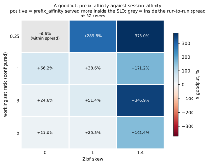
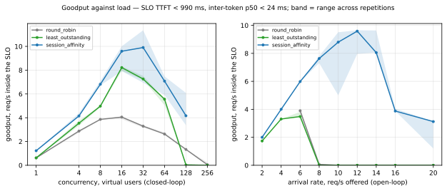
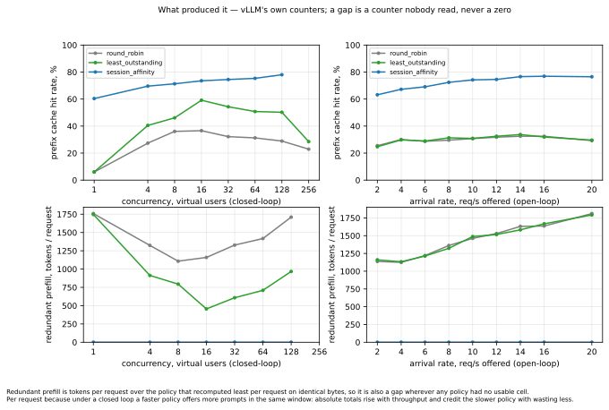
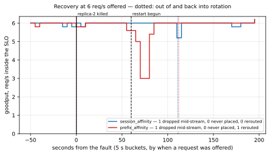
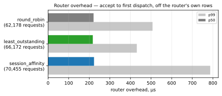

# kvroute

**Where does cache-aware routing stop paying for itself against the consistent-hash session
affinity any load balancer already gives you for free?**

kvroute is a KV-cache-aware router in front of six single-GPU vLLM replicas, built to answer that
question and nothing else. The deliverable is a measured comparison of routing policies, not a
service. See [`idea.md`](idea.md) for the spec and [`CONTEXT.md`](CONTEXT.md) for the vocabulary
every figure here is stated in.

Six policies are implemented; four have been measured on the fleet. Every number below is
recomputable from rows kept in this repository, and every figure is regenerated by one command
(`make figures`) with no GPU in the path.

## The results

One point of the grid: the frozen comparison workload at **working set 1.0, skew 0**, closed loop
at 32 virtual users, five replicas, three repetitions. Goodput is requests per second that met the
derived SLO of **TTFT < 990 ms and inter-token p50 < 24 ms**.

| policy | goodput/s | TTFT p99 | prefix cache hit rate | requests | redundant prefill / request |
|---|---:|---:|---:|---:|---:|
| round robin | 3.51 (3.37–3.55) | 3,918 ms | 33.9% | 4,753 | +1,354 (+6.44 M tokens) |
| least outstanding | 7.84 (7.71–8.16) | 2,130 ms | 56.4% | 7,790 | +650 (+5.06 M tokens) |
| session affinity (consistent hash) | 8.99 (8.19–10.24) | 1,622 ms | 76.6% | 8,781 | +26 (+0.23 M tokens) |
| **prefix affinity** | **14.94 (14.72–15.10)** | **1,440 ms** | 77.5% | 11,873 | **best** |

Prefix affinity is **+66.2%** over session affinity here, and the two policies' repetition ranges
do not overlap. It is not an artefact of caching more: the two hit rates differ by 0.9 points. It
is also the policy that wasted least, which the hit rate alone could not have said.

Redundant prefill is compared **per request**, and the token total is shown beside it only so the
two can be told apart. Under a closed loop a virtual user sends its next turn when its last one
returns, so a faster policy offers more prompts in the same window: the identical workload
guarantees the same generator, not the same number of prompts. In absolute tokens prefix affinity
looks like it wasted 1.92 M more than session affinity here — it served 3,092 more requests to do
it, and per request it wasted less. A token figure in this column is a policy's per-request excess
times **its own** requests, never a difference of two policies' totals
([#30](https://github.com/yuchia329/kvroute/issues/30)).

## The pressure map

The headline figure. Goodput delta between session affinity and prefix affinity across working set
ratio crossed with Zipf skew, at one concurrency — memory pressure on one axis, load imbalance on
the other, because they are physically different and trip different branches of the spill rule.



| WS \ skew | 0 | 1 | 1.4 |
|---|---:|---:|---:|
| **0.25** | −6.8% (within spread) | +289.8%¹ | +373.0% |
| **1** | +66.2% | +38.6% | +171.2% |
| **3** | +24.6% | +41.3% | +346.9% |
| **8** | +21.0% | +25.3% | +162.4% |

¹ Two repetitions, not three: one was flagged for warm-up drift, re-run, and drifted harder. The
direction holds either way — session affinity's best repetition sits below prefix affinity's worst —
but the size does not. See the [measurement](docs/measurements/2026-09-11-pressure-grid/).

**Cache-aware routing pays everywhere except the low-pressure corner**, and it pays most where
traffic concentrates. At WS 0.25 / skew 0 the whole working set fits in cache and there is no
imbalance to fix: the two policies are indistinguishable, which is exactly where idea.md §0
predicted they would be.

**The mechanism is not cache reuse.** Between the two affinity policies the prefix cache hit rate
differs by 0.0–2.2 points at every point of the grid, and per request they recompute prefill within
about 5% of each other. What separates them is load: session affinity hashes a conversation onto one
replica and keeps it there, so concentrated traffic piles onto one card, while prefix affinity's
spill rule moves a turn of an overloaded conversation elsewhere — which then caches it too, so the
match ties across both and the tie goes to the least loaded.

A second arm proves it. Running prefix affinity with the spill rule **off** across the same grid
loses 5–51% of its goodput at eleven of twelve points, and pins each hot conversation to about one
replica just as the hash does. With the rule on, the busiest replica sits at fair share (21–22%)
everywhere. A rule that fires on 0.2–2.5% of decisions accounts for up to a doubling of goodput.

## Goodput against load, and what produced it





Three policies over both load axes, 2026-09-08
([measurement](docs/measurements/2026-09-08-three-policy-multiturn/)). Session affinity roughly
doubles the fleet's usable capacity against round robin, and the open-loop panel is where the fleet
falls over: round robin and least outstanding reach zero goodput at 8 req/s offered, while session
affinity still holds 7.63/s.

A gap in these plots is a load point where no usable cell survived, never a zero. A zero is a fleet
that served nothing inside the SLO, and the two must not read alike.

## Surviving a replica dying



One replica killed under steady open-loop load at 6 req/s and restarted 60 s later, once per policy
([measurement](docs/measurements/2026-09-11-chaos-recovery/)). Both policies held 5.98/s before the
fault. Both lost exactly **one request of 1,501** — the one that was mid-stream when its replica
died, which cannot be rerouted. Draining a replica through the router instead of killing it dropped
**nothing**.

| | session affinity | prefix affinity (spill off) |
|---|---:|---:|
| goodput before the fault | 5.98/s | 5.98/s |
| lowest from the fault on | 5.20/s at +110 s | 3.00/s at +70 s |
| deficit | 7 requests | 43 requests |
| back within 10% for good | +115 s | +80 s |
| dropped mid-stream / never placed | 1 / 0 | 1 / 0 |
| rerouted before a first token | 0 | 1 |

**The two policies pay at opposite moments.** Session affinity is flat through the whole outage —
four replicas at 6 req/s is inside what the fleet can serve — and dips only when the replica returns
and the ring moves its sessions back onto an empty cache. Prefix affinity dips *during* the outage,
when the conversations orphaned by the kill land together on one replica (47% of the load against a
25% fair share), and has cleared before the replica is back. Neither is "better at recovering" on
one run each; the pair shows where each one's cost falls.

Ejection took 0.4–0.5 s after the kill, on two failed health checks. Readmission took ~111 s, on two
passed ones, with nothing else restarted.

## Router overhead

The obvious alternative explanation for any of this is that the router simply added latency the
baselines did not pay. It did not.



| run | policy | dispatched | p50 | p99 |
|---|---|---:|---:|---:|
| 2026-09-08 sweep | round robin | 62,178 | 221 µs | 507 µs |
| | least outstanding | 66,172 | 217 µs | 431 µs |
| | session affinity | 70,455 | 223 µs | 787 µs |
| 2026-09-11 chaos | session affinity | 1,801 | 223 µs | 1,161 µs |
| | prefix affinity | 1,801 | 383 µs | 822 µs |

Accept to first dispatch, off the router's own per-request rows rather than the client's — TTFT is
measured at the client with this inside it, so only the router's record can separate them. Consulting
the prefix index costs about 160 µs more than hashing a session id, against TTFT p50s of hundreds of
milliseconds and a goodput difference of +66%. Two runs rather than one because no single run carries
every policy, and a closed-loop p50 and an open-loop one through a replica failure are not the same
measurement.

## Belief divergence: how wrong the index is

The router models state it does not own. Replicas evict on their own schedule and nothing tells the
router when they do, so its prefix index is a belief that decays. Nobody publishes how fast — so
this project measures it, and the result stands whichever policy wins.

Every request carries both sides on one row: the prefix match the router decided on, and the
engine's own `usage.prompt_tokens_details.cached_tokens` for that same request.

**99.7% of the tokens the index claimed were really there**, over 16,752 requests of the clean
working-set run ([measurement](docs/measurements/2026-09-10-belief-divergence/)). The errors run
overwhelmingly the safe way: 15,375 requests under-predicted against 1,362 that over-predicted.
Forgetting a block a replica still holds forfeits a match; believing in one it has evicted pays the
full prefill *and* spends the routing decision on a reason that had stopped being true. The two are
never netted into one figure.

| working set (nominal) | requests | honoured | over-predicted | mean tokens over |
|---|---:|---:|---:|---:|
| 0.25 | 10,626 | 100.0% | 951 | 4 |
| 1 | 3,689 | 98.9% | 317 | 314 |
| 8 | 2,437 | 99.5% | 94 | 241 |

**Memory pressure makes the index wrong in bigger pieces, not more often.** The honoured share
barely moves while the mean over-prediction climbs eighty-fold. A fleet that cannot hold its working
set does not produce more stale beliefs; it produces stale beliefs that are worth more when they
land.

That measurement then sizes the index: the node cap is the fleet model scaled by the share of belief
the engines honoured, which trimmed it by 0.3% (16,311 → 16,266). The modelling decision
[ADR-0006](docs/adr/0006-the-prefix-index-is-bounded-by-measurement.md) could not verify turns out to
have been very nearly right.

## Null and negative results

These are findings, in the same voice as the positive ones.

- **Cache-aware routing does not pay at WS 0.25 / skew 0.** Prefix affinity is 6.8% *below* session
  affinity there, inside the run-to-run spread. With the whole working set in cache and no imbalance
  to correct, every spill only moves a turn to a replica that does not hold it: the spill-off arm
  scores 8.9% higher at that one point, with a hit rate 2.3 points better.
- **The two pressures could not be shown to be separable, and that is a scoping loss.** The spill
  rule's KV branch was off for every cell, because `vllm:kv_cache_usage_perc` counts blocks held by
  *running* requests — it reads the active batch, not cache residency, and tracks inflight at
  r = 0.973 on this fleet. On this host the KV branch *is* the load branch. That waits on
  [#28](https://github.com/yuchia329/kvroute/issues/28), and the map says so rather than reporting a
  column of zeros as a result.
- **The spill rule is tuned for one load and misfires at another.** At 6 req/s open-loop it fired on
  19% of later turns, against 0.674% at the 32-user rung it was settled at, because it compares
  inflight counts that are small integers when the fleet holds ~12 requests. 42% of spilled turns
  missed the SLO. That is [#31](https://github.com/yuchia329/kvroute/issues/31), and it is why the
  recovery curves above use the spill-off arm.
- **Disaggregating prefill and decode is not ruled out by bandwidth here, and the margin is six times
  thinner than the spec assumed.** Moving a 2,048-token request's KV costs 36.7 ms against the
  490.7 ms of prefilling it: **7.5%**, where idea.md §8 predicted 1.3%. No pair of cards on this host
  can reach another directly — the driver reports peer access unsupported on all 30 ordered pairs —
  so every card-to-card copy bounces through host memory. Nothing was built; the arithmetic settled
  it ([measurement](docs/measurements/2026-09-11-pcie-arithmetic/)).
- **The index's decay curve is not a published result.** Every cell of the recency run is flagged as
  still warming up, which is precisely the condition that manufactures under-prediction. It needs a
  re-run ([#29](https://github.com/yuchia329/kvroute/issues/29)).
- **An earlier headline was an artefact and is withdrawn.** The first two-policy comparison, on six
  cards, concluded that balancing load *cost* goodput — least outstanding losing 16–32%. GPU 3
  thermally throttles whenever all six cards draw power at once, so round robin was feeding a
  sacrificial queue that passed nothing while the others passed everything. On five symmetric cards
  the same pair inverts and least outstanding wins by 100–120%.
- **The column that was supposed to show imbalance recorded nothing, for the life of the policy.**
  Every row carries the chosen replica's inflight at the moment it was chosen, and every
  `session_affinity` row written before 9311e68 carries zero — the hash ring stored candidates
  rather than replicas and is rebuilt only when the replica *set* changes, so the load it reported
  was frozen at whichever request first built it, on an idle fleet. Nothing routed differently,
  because the hash weighs no load by design, so every comparison published here stands. What was
  lost is the evidence for the balance half of idea.md §5, and it could only be recovered because
  the per-request rows name the replica that served each request: counting those at 64 users gives
  session affinity a busiest replica on 24.6–26.6% of requests against a 20% fair share, where
  round robin sits at 20.0–20.2%. Imbalance is now counted from the rows on every cell rather than
  read off the router's own bookkeeping ([#27](https://github.com/yuchia329/kvroute/issues/27)).
- **Policy 5 is built and unmeasured.** Exact residency follows the engines' own KV cache events, so
  it knows what a replica holds rather than believing it. It has no fleet run yet, so it appears in
  no table here.
- **The stateless control is built and unmeasured.** `prefix_hash` holds no index and no session
  state: it hashes the prompt's leading blocks — the prefix index's own blocks — onto session
  affinity's own ring and weighs that ranking against inflight. It is the rung below prefix
  affinity, so the three together read as a ladder of how much a router knows about what its
  replicas hold: **none → believed → exact**. It has no fleet run yet either, so it appears in no
  table here. It is a mechanism inferred from OpenAI's public documentation of a hash of "the
  initial tokens" plus machine load, and is **not** a reproduction of their router: the window, the
  weighting and the placement are all choices made here, and no number for any of them has been
  published ([#26](https://github.com/yuchia329/kvroute/issues/26),
  [ADR-0012](docs/adr/0012-the-stateless-hash-is-the-same-ring-and-the-same-blocks-as-the-policies-it-controls-for.md)).

## How the comparison was kept fair

- **Identical bytes.** Two policies at the same load point send the same prompts: the workload slice
  is keyed on the load axis and the repetition and deliberately not on the policy. `compare` refuses
  cells whose workload names differ.
- **A cold fleet for every policy.** The replicas run with prefix caching on, so a second pass would
  read back what the first prefilled. [ADR-0004](docs/adr/0004-every-measurement-sends-unseen-bytes.md)
  measured that at TTFT p50 ~325 ms for unseen prompts against ~46 ms for the same prompts re-sent —
  a sevenfold head start on the primary metric. The fleet is cycled between policies, every time.
- **One SLO, derived rather than chosen.** TTFT < 990 ms and inter-token p50 < 24 ms is **3× the
  measured latency floor** (TTFT p50 329 ms, inter-token p50 7.8 ms over 1,487 requests at
  concurrency 1, straight at each replica, pooled). The multiple is a judgement and the floor is not,
  so the two are published together
  ([ADR-0003](docs/adr/0003-slo-is-three-times-the-measured-floor.md)). `compare` refuses to put
  cells judged against two different SLOs in one table.
- **Which driver produced which table.** The closed-loop driver holds a fixed number of virtual users
  and throttles itself when the fleet slows, so its tail is optimistic by construction; the open-loop
  driver fires on a schedule regardless, records how late each request went out, and flags a cell
  whose driver fell behind. Every table names its driver, and the two are never merged into one
  column.
- **Contamination, per cell.** The box is shared. Every cell carries its own `nvidia-smi` evidence,
  and a cell that saw a foreign process on any card is discarded and re-run rather than averaged in.
  "Nothing was found" and "nothing was looked for" are different states and are recorded differently.
- **Flagged cells are excluded and listed — except one kind.** A cell that dropped or failed more
  requests than the ~1% threshold allows stays in the figures, marked ⚠ and named: it measured a
  fleet that was falling over, which is a result about the policy. A contaminated cell, one still
  warming up, one that lost a replica mid-window, or one whose residency stream broke is a broken
  measurement and is excluded.
- **Three repetitions, and the spread is published.** Each figure is the median with the range across
  repetitions beside it, and any difference smaller than those ranges is labelled *within spread*
  rather than left to read as a result.
- **The fleet is five cards, not six.** GPU 3 is excluded: it throttles on heat rather than the
  normal equal power cap — `SwThermal` in 67% of samples against 0–34% for the others, clocking to
  960 MHz at 75 °C while a 83 °C card holds 1,305 MHz. A permanently slow card *is* a permanent load
  imbalance, which is the mechanism under test, and it is paid unequally by load-aware and load-blind
  policies ([#25](https://github.com/yuchia329/kvroute/issues/25),
  [measurement](docs/measurements/2026-09-07-gpu3-thermal/)).
- **Replica symmetry, checked.** Driven one at a time the replicas agree to 1.5–2.3%; driven all six
  at once the spread is 12.7% and grows with time on load. The spec's symmetry check drives them one
  at a time, which is the one configuration in which the effect cannot appear — `make contention` is
  what surfaced it.

## Measured facts everything else scales off

Six replicas of `Meta-Llama-3.1-8B-Instruct-AWQ-INT4`, one per RTX 3090
([characterization](docs/measurements/2026-09-07-characterization/)).

| Quantity | Measured |
|---|---|
| Fleet KV capacity | **755,712 tokens** across six cards, **629,760** across the five used for the comparison — 7,872 `num_gpu_blocks` × 16 per replica, read off each replica's own configuration and summed, never extrapolated |
| Latency floor | **TTFT p50 329 ms, inter-token p50 7.8 ms**, at a 1.3% prefix cache hit rate — a prefill cost, not a cache lookup |
| SLO | **TTFT < 990 ms, inter-token p50 < 24 ms** (3× the floor) |
| Prompt bytes per token | **1.59 bytes/token**, measured over 410 M prompt bytes against 258 M engine-reported tokens — the conversion every byte-denominated prefix figure is read through |
| Host topology | GPUs 0–3 on NUMA 0 at 12 threads each, GPUs 4–5 on NUMA 1 at 24 |
| Router overhead | **217–223 µs p50**, 431–787 µs p99 |

The rows behind every figure are in [`docs/measurements/`](docs/measurements/). Sweep output is
gitignored because a full pass is hundreds of megabytes; a reference run the README cites is not,
because a figure whose rows have been deleted is an assertion rather than a measurement.

## Prior art, and how this differs

Cache-aware routing is an active production pattern, not an original idea. This project does not
claim the mechanism. **Every claim below was re-checked against a primary source on 2026-09-11**;
per-claim verdicts, quotes and URLs are in
[`docs/research/prior-art-routing.md`](docs/research/prior-art-routing.md), which carries a permanent
re-verify warning because three of its claims moved within four weeks during research.

| System | What it does |
|---|---|
| **SGLang** | Two routers. The shipping `sgl-model-gateway` keeps an approximate radix tree per worker over raw text. Its replacement, `experimental/sgl-router`, **removed** the `cache_aware_zmq` policy and the `--cache-threshold`, `--balance-abs-threshold` and `--balance-rel-threshold` flags, and takes its prefix signal from "the Router-local radix tree (the default), or the external Indexer" |
| **NVIDIA Dynamo** | A `KVPublisher` on each worker emits stored/removed block events; a `KvIndexer` builds a global prefix tree from them, while active decode blocks are counted locally in the router. Picks the lowest-cost worker under a formula crediting device/host/disk cache overlap against prefill load: *"Higher overlap credits favor cache reuse (improving TTFT), while lower credits prioritize even load distribution (improving ITL)"* |
| **llm-d / Gateway API Inference Extension** | Kubernetes endpoint picker with pluggable scorers, fed by an approximate producer (routing-history belief, the default) or a precise one (a real KV-block index over ZMQ KV events). Publishes precise-vs-approximate P90 TTFT of **0.542 s against 31.083 s** on 8 vLLM pods × 2 H100 running Qwen-32B (2025-09-24). The EPP has **moved** to `llm-d/llm-d-router` |
| **AIBrix** | Envoy ext-proc router whose `prefix-cache` strategy "routes to a pod that already has a KV cache matching the request's prompt prefix; the best prefix-matched pod within a stddev load threshold is selected", in a local hash table or KV-event-synced distributed index mode, behind a central gateway imbalance gate |
| **vLLM production-stack** | Reference router: round-robin and session-ID routing ship; **"Prefix-aware routing (WIP)"**. Evidence that session stickiness is the shipped default in the vLLM ecosystem |
| **Mooncake (Kimi / Moonshot)** | arXiv 2407.00079 (v4, 2025-09-03). A KVCache-centric global scheduler that hashes prompt blocks, estimates queueing plus prefill per instance from the per-instance prefix length, assigns the shortest predicted TTFT, and adds a prediction-based early rejection policy under overload. The closest published relative of this project's spill rule |
| **OpenAI `prompt_cache_key`** | Cache-affinity routing, productized. Routing depends on "Current machine load and available capacity" and "A hash of the initial tokens", with the limit stated plainly: *"Keys influence routing; they do not pin requests to a machine or guarantee a cache hit."* Cached input discounted up to 90%; minimum 1,024 tokens on GPT-5.6+; a prefix stays reusable 30 minutes; above ~15 requests/minute a machine overflows |
| **MiniMax-M2** | arXiv 2605.26494 §6.2.6: *"A cost-aware request router dynamically balances queuing delay against cache migration costs, maximizing cache locality"* over a DFS-backed global KV cache — in their agent-RL rollout stack, not stated to be the production API path |
| **DeepSeek** | Publishes the cache and the disaggregation, not the router: 342B of 608B input tokens (**56.3%**) hit the on-disk KV cache, behind three load balancers that equalize input token counts, request counts, aggregate KVCache usage and expert dispatch — none of them prefix-locality-aware |

**The field is convergent.** Every system above scores replicas by predicted prefix reuse and
penalizes by load. Policy 4 is that same shape. The two real axes of variation are approximate
router-side index versus exact engine-published events, and how aggressively the load term overrides
the locality term — precisely this project's `KV_HIGH_WATER` and `LOAD_IMBALANCE_FACTOR`.

**And the ablation this project runs has already been published, at datacentre scale.** Saying
otherwise would be wrong and instantly caught:

- **Anyscale / Ray Serve LLM** (2026-08-25) benchmarked `ConsistentHashRouter` against
  `KVAwareRouter` and a cache-only variant on one harness: *"KVAwareRouter has the best p99 rollout
  end-to-end latency despite lower prefix cache hit rate."* It also names where consistent hashing
  remains a strong choice — expensive cache misses, limited cross-session reuse, similar-sized
  sessions.
- **CacheRoute** (arXiv 2608.19677, 2026-08-20) uses sticky consistent hashing and
  consistent-hashing-with-bounded-loads as two of five baselines on Llama-3.3-70B across 60 H100s,
  reaching 176 ± 11 QPS at a 3.5 s p99 SLO against Sticky's 30 QPS *at the highest KV hit rate of the
  baselines* (87.3%), and publishes an envelope where *"affinity can reduce capacity when the
  recoverable prefix work is small"* — 0.50–0.67× capacity on one workload.
- **llm-d** (2026-08-17) publishes a numeric threshold at which it abandons stickiness: τ = 286,720
  tokens, "35 max-num-batched-tokens chunks of pending uncached prefill work", on 10× Qwen3-32B.

**So what is left is narrower, and it is what this project claims:**

1. **The comparison at single-host, consumer-GPU scale.** Every published version runs at 8–60
   H100/H200-class GPUs with 32B–70B models, multi-node. None runs on one host with six consumer
   cards and a 4-bit 8B model, where a working set can be pushed past fleet capacity deliberately and
   the crossover sits somewhere else entirely.
2. **A two-axis pressure map** parameterized by working-set ratio over *measured* aggregate fleet KV,
   crossed with Zipf skew — memory pressure and load imbalance separated as independent axes. No
   published version of this comparison does that. (CacheRoute comes closest, parameterizing by
   recoverable prefix work and key skew.)
3. **Belief divergence** — the gap between the router's model of cache residency and the engine's own
   account of what it computed, per request. Nobody publishes this at any scale.

## Reproduce

Every figure and table, from a checkout, with no fleet and no GPU:

```sh
make figures        # six figures + their data, from docs/measurements
make figures-test   # the plotting script's tests
make test           # the full Go suite under the race detector
```

`make figures` needs Go and [uv](https://docs.astral.sh/uv/); uv installs the plotting script's
pinned matplotlib on first use. Go computes every number and writes it as JSON; the script only
draws, so a figure cannot disagree with the table beside it. The SVGs are deterministic — the same
data regenerates the same bytes.

Without a GPU, the router itself runs against a fake replica:

```sh
make run-fake      # one fake replica on :8000
make run-router    # router on :8080, round-robin, RECORDS=path to keep rows

curl -N http://127.0.0.1:8080/v1/chat/completions \
  -H 'Content-Type: application/json' \
  -d '{"model":"m","messages":[{"role":"user","content":"hello"}],"stream":true}'

curl -s http://127.0.0.1:8080/router/stats   # router overhead p50/p99, inflight per replica
```

Against the real fleet, in order — the SLO has to be measured before anything is judged against it,
and the fleet has to be cycled between policies:

```sh
make linux                                                 # static binaries; the box has no Go
make fleet-up                                              # preflight, then replicas one at a time
make contract CONTRACT_REPLICA="$(ops/fleet.sh replicas)"  # hold the fake to every replica
make characterize                                          # capacity, topology, floor, SLO, symmetry
export SLO_FROM=runs/characterization                      # the SLO comes from the record

make run-router POLICY=session_affinity REPLICAS="$(ops/fleet.sh replicas)" &
make bench   POLICY=session_affinity REPS=5
make goodput POLICY=session_affinity REPS=5
kill %1
make fleet-down && make fleet-up        # NOT optional: ADR-0004

make calibrate                          # the index's cap and TTL, measured off the fleet
make run-router POLICY=prefix_affinity REPLICAS="$(ops/fleet.sh replicas)" &
make bench   POLICY=prefix_affinity
make goodput POLICY=prefix_affinity
kill %1

make compare                            # every policy, both axes, one table
make divergence                         # how wrong the index was, and by how much
make pressure-grid PRESSURE_WS=1 PRESSURE_SKEW=0 POLICY=prefix_affinity   # one grid point
make pressure-map                       # the headline figure's data
```

`ops/versions.env` is the single source of truth for everything held constant between cells — engine
version, model, quantization backend, prefix caching, chunked prefill, the GPU-dirty threshold.
Nothing downstream keeps a second copy. Sweeps resume: finished cells are reused, the interrupted one
is re-run, a contaminated one is moved aside and re-run, and deriving the SLO later resummarises
cached cells from their own rows rather than costing another hour of GPU time
([ADR-0002](docs/adr/0002-jsonl-during-parquet-after.md)).

## What runs

```
cmd/bench ──► router (:8080) ──► replica-0..5 (:8000..:8005, one GPU each)
    │             │                   │
    │             │                   └─ /v1/chat/completions (SSE), /metrics
    │             └─ six policies, exact per-replica inflight, scraped KV utilization,
    │                health checks and ejection, per-request JSONL rows
    └─ closed-loop and open-loop drivers, per-cell caching, nvidia-smi sampling

cmd/compare ─┐
cmd/pressuremap ─┤── the records the runs wrote, no fleet in the path
cmd/recovery ─┤    └─ tables and figure data: goodput, the map, recovery curves
cmd/overhead ─┤
cmd/divergence ─┘

cmd/characterize ──► replica-0..5, one at a time, no router in the path
    └─ KV capacity, topology, the latency floor, the SLO, replica symmetry
```

- **`cmd/router`** — OpenAI-compatible `POST /v1/chat/completions`, SSE passed through untouched,
  one row per request, its own cost at `GET /router/stats` and `GET /metrics`. `-policy` selects the
  rule: `round_robin`; `least_outstanding`; `session_affinity`, which hashes a conversation onto a
  ring of replicas; `prefix_affinity`, which routes to the replica believed to hold the longest
  leading run of the prompt's bytes and declines that match under load pressure;
  `exact_residency`, which follows the engines' own KV cache events instead of a belief
  ([ADR-0010](docs/adr/0010-exact-residency-asks-the-engine-for-tokens-and-forgets-what-it-cannot-vouch-for.md));
  and `prefix_hash`, which hashes the prompt's leading blocks onto the same ring and weighs it
  against inflight, holding no index at all
  ([ADR-0012](docs/adr/0012-the-stateless-hash-is-the-same-ring-and-the-same-blocks-as-the-policies-it-controls-for.md)).
  Inflight is counted locally and exactly, never scraped: a scraped figure would read the same for
  every request inside one polling window and stampede them all onto one replica.
- **`cmd/bench`** — the two drivers and the sweeps. Refuses to start unless every replica answers
  `/health`, warms each one at its own port, counts dropped, failed and SLO-violating requests in
  three separate columns, samples the GPUs throughout, and resumes from cached cells.
- **`cmd/calibrate`** — measures the prefix index's node cap and TTL off the fleet rather than
  defaulting them in source, and refuses rather than substituting a constant for a measurement it
  could not take ([ADR-0006](docs/adr/0006-the-prefix-index-is-bounded-by-measurement.md),
  [ADR-0008](docs/adr/0008-the-node-cap-is-calibrated-against-measured-divergence.md)).
- **`cmd/chaos` / `cmd/recovery`** — take one replica away under load and bring it back, then compare
  the curves. Refuses to compare runs that did not face the same failure.
- **`cmd/preflight`** — refuses to bring the fleet up while any GPU already holds memory; the same
  probe backs the per-cell contamination check.
- **`cmd/fakereplica`** — a programmable stand-in with configurable TTFT and inter-token latency, so
  everything above the replica HTTP boundary runs without a GPU. `test/contract` holds it to the real
  engine's behaviour.

## Watching a run live

The router serves `GET /metrics` in Prometheus format: per-replica inflight, the decision mix by
reason, and its own overhead and TTFT as histograms.

```sh
ops/prometheus.sh up     # on the fleet host, loopback only
make dashboards-up       # on the workstation: ssh tunnel + Grafana
```

Five panels: per-replica KV utilization and inflight, prefix cache hit rate, TTFT p50/p99, decision
mix, router overhead. It is for watching and nothing else — no sweep reads it, and the rows stay the
system of record, because a panel's p99 is interpolated from a sample every few seconds and the
rows' is exact.

## Design notes worth knowing before reading the code

- **SSE fidelity is non-negotiable.** Break streaming and TTFT stops being measurable, which ends the
  project. A test compares the bytes from the router against the bytes from the replica.
- **The decision reason is a return value, not a log line.** The mix of affinity, cold, spill and
  untokenized decisions is a reported result, so a policy returns it alongside the replica.
- **Inflight is counted, never scraped; KV utilization is scraped, never counted.** The router is the
  sole ingress, so it knows exactly what it dispatched; cache occupancy is the one load signal it
  cannot derive locally.
- **Dropped, failed, cancelled and SLO-violating never share a column.** Under overload a replica
  rejects in milliseconds; fold those into a latency distribution and an overloaded fleet looks
  *faster*.
- **Warm-up is a duration, and it is checked rather than trusted.** Each cell compares TTFT p50 over
  the first half of its measured window against the second, and is flagged if it was still speeding
  up. That check is why several cells in these measurements were re-run.
- **Absent is never zero.** A policy with no usable cell at a load point is a gap in the table, an
  unread counter is an em dash, and a cell nobody sampled for foreign processes says so rather than
  claiming to be clean.
- **The records are the system of record.** Every published figure is recomputable from the JSONL
  rows; Parquet is the derived artefact, and compaction never deletes the JSONL
  ([ADR-0002](docs/adr/0002-jsonl-during-parquet-after.md)).
</content>
