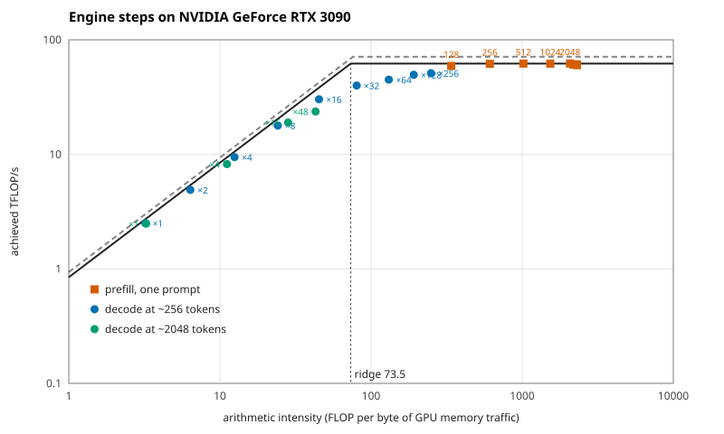

# Roofline — 2026-09-11

Where the engine's own work sits against the card's limits: decode waiting on memory, prefill
waiting on arithmetic, on this hardware with this model. This is issue #23, and idea.md §9's
instruction in full — profile vLLM's steps rather than write a kernel, and publish the roofline.

No kernel was written. Nothing here is a claim about kernels at all: it is a claim about where the
two halves of serving a conversation *have* to sit, which is what decides what a router upstream of
them can hope to change.

| | |
|---|---|
| host | `nlp-gpu-01.be.ucsc.edu`, one replica on **GPU 1** of six RTX 3090s |
| engine | vLLM 0.28.0, `Meta-Llama-3.1-8B-Instruct-AWQ-INT4`, every setting from `ops/versions.env` ([`evidence/engine-args.txt`](evidence/engine-args.txt)) |
| profiler | Nsight Systems 2026.1.3, CUDA and NVTX, per-node CUDA graph tracing, driver 595.84 |
| plan | prompts of 128 to 8,000 tokens prefilled alone, ×3; decode batches of 1 to 256 at ~256 tokens of context and of 1 to 48 at ~2,048, 64 tokens each |
| steps | **1,001 captured**, 740 pooled into the 22 points below, 261 not drawn |
| report | [`roofline.md`](roofline.md) — the table this README reads from |

## How it is measured

A step's position needs three numbers: the arithmetic it did, the bytes it moved, and the GPU time
it took. **Only the time is measured.** The other two are counted from the model's shapes and the
step's own composition, which vLLM's profiler annotates onto every engine step — per phase, the
requests, their new tokens, the sum of their sequence lengths, and the sums that give causal
attention its exact query-key pairs.

They are counted because they cannot be read here: **Nsight Compute needs GPU performance counters,
and this driver reserves them for root** (`RmProfilingAdminOnly: 1`, and there is no sudo on a shared
box). That is a real limitation and it cuts one way only. The count is the *least* the step could
have done — every weight read once, every key and value fetched once, each linear layer's input read
and output written — so a kernel that moves more bytes than it must appears as a lower achieved
rate, never as a different intensity. The horizontal position of every point is the model's; only
its height is the engine's.

The roofs are measured on the same card minutes before the run, with library calls rather than the
datasheet: a large fp16 GEMM through cuBLAS (fp32 accumulate, which is what Marlin accumulates in
too) and a large device-to-device copy. **62.0 TFLOP/s and 844 GB/s**, against the datasheet's 71
and 936 — the card under its own clocks and power cap, which is what the steps ran under too.

## Result: prefill is compute-bound, and decode is bandwidth-bound where it matters

**Every prefill point reaches 95–100% of the measured compute roof**, from a 128-token prompt at 339
FLOP/byte to a chunk of an 8,000-token one at 2,303. Prefill is arithmetic, and this engine is
already extracting essentially all of the card's arithmetic.

**Decode at a realistic context never gets near it.** At ~2,048 tokens — a session of the frozen
workload — even 48 sequences decoding together reach only 42.9 FLOP/byte, against a ridge at 73.5,
and run at 551 GB/s of memory bandwidth:

| decode at ~2,048 tokens | ×1 | ×4 | ×16 | ×48 |
|---|---:|---:|---:|---:|
| FLOP/byte | 3.2 | 11.1 | 28.3 | 42.9 |
| achieved GB/s | 763 | 738 | 671 | 551 |
| of the measured roof | 90% | 87% | 79% | 65% |

The mechanism is the KV cache. A step reads all 4.7 GB of weights once however many sequences it
serves, so batching amortises them — but each sequence also reads its own KV, 128 KiB per token of
context, and *that* grows with the batch. At 2,048 tokens of context a batch of 48 reads 12.9 GB of
KV against 4.7 GB of weights, so the bytes climb as fast as the arithmetic does and the intensity
stalls.

**Only a short context lets decode cross the ridge**, and the crossing is visible: at ~256 tokens of
context the batch of 32 is the first compute-bound point.

| decode at ~256 tokens | ×1 | ×8 | ×16 | ×32 | ×128 | ×256 |
|---|---:|---:|---:|---:|---:|---:|
| FLOP/byte | 3.2 | 24.2 | 45.3 | **80.3** | 192 | 249 |
| bound by | bandwidth | bandwidth | bandwidth | compute | compute | compute |
| of the measured roof | 92% | 87% | 79% | 64% | 80% | 83% |

So "decode is memory-bandwidth-bound" is true of this fleet rather than of decode in general: it is
true because the sessions are long, and it would stop being true if they were short and the batches
huge.

### What it means upstream, for the router

- **The prefill a router avoids is compute the card was spending at ~100% of its roof.** Redundant
  prefill is not waste the engine could have scheduled away; it is arithmetic at full rate that did
  not need doing. That is the quantity prefix affinity exists to remove.
- **Holding more sessions per replica costs bandwidth, not just capacity.** Decode's bytes are the
  KV of everything resident, so a policy that packs sessions onto one replica moves that replica
  down its own bandwidth roof. Spill is not only about eviction.
- **The two halves compete for different limits**, which is why a step that mixes them is neither:
  261 of the 1,001 steps are mixed or a batch's tail, and are counted rather than drawn.

## Caveats

🚩 **Another user's job appeared on GPU 3 for the last ~18 seconds of the run** — 14.8 GiB from
16:06:00, 41 telemetry samples, on a card this run does not use. It cannot touch GPU 1's memory
bandwidth, but it shares the host and the power envelope, and it overlaps the **~2,048-token decode
batches of 16 and 48**, the two points the headline leans on hardest. Their neighbours at ×1 and ×4
ran clean and sit on the same line. A clean re-run wants the box idle, which it has not been since.

⚠️ **The trace costs something.** Per-node CUDA graph tracing was kept because it names the kernels,
and it inflates step times a little — which lowers every point rather than moving it sideways. The
one cross-check available: a 2,048-token prefill step took **485 ms traced** here, against **479 ms
untraced** for the same prompt length on the same engine in [#22's prefill
measurement](../2026-09-11-pcie/) — 1.3% apart.

⚠️ **The card was power-capped, as it always is under load.** 219 of card 1's telemetry samples
report the software power cap and none report a thermal limit, at a median SM clock of 1,605 MHz
against a 1,935 MHz maximum. The roofs were measured on the same card under the same cap, so roofs
and points are comparable; neither is a datasheet number.

⚠️ **Prompts longer than 2,048 tokens arrive as chunks**, because chunked prefill is on and the
engine batches 2,048 tokens at a time. Those points are labelled "over" their context — a 2,048-token
chunk of a 6,144-token prompt attends to all 6,144, which is why its intensity is higher than a
standalone 2,048.

## What is here

| file | what it is |
|---|---|
| [`roofline.md`](roofline.md) | every point, its intensity, its achieved rate and which roof bounds it |
| [`roofline.svg`](roofline.svg) | the figure |
| [`steps.jsonl`](steps.jsonl) | **the system of record**: one line per engine step, its composition and its GPU time |
| [`ceilings.json`](ceilings.json) | the measured roofs, with every trial |
| [`model-config.json`](model-config.json) | the model's shapes, which the work is counted from |
| [`evidence/`](evidence/) | the engine's argv and log, the drive log, the run's environment, and GPU telemetry every 500 ms |

nsys's own exports — 147 MB of GPU operations and 55 MB of trace — stay on the box. Everything above
is redrawn from `steps.jsonl` with `roofline report`, which needs no GPU:

    roofline report -dir docs/measurements/2026-09-11-roofline
